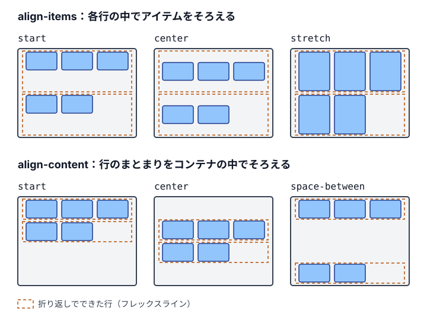

import Demo from '../../../components/Demo.astro';
import Guideline from '../../../components/Guideline.astro';
import alignmentHtml from '../../../demos/layout/alignment-items-content/index.html?raw';
import alignmentCss from '../../../demos/layout/alignment-items-content/style.css?raw';

CSSのレイアウトは、1つの仕組みではなく、通常フロー、Flexbox、Grid、位置指定（`position`）といった複数の方式の組み合わせでできています。同じ `margin` や `align-items` でも、要素がどの方式の中に置かれているかで、効き方が変わります。指定が思いどおりに効かないときは、値を足す前に、その要素がどの方式の中にあるかを確かめます。

あわせて確かめるのは、大きさや位置の基準になる要素（包含ブロック）と、重なり順を決める範囲（スタッキングコンテキスト）です。この節では、方式の全体像と、どの方式にも共通するこれらの仕組みを説明します。各方式の規則は、続く10-2〜10-7でそれぞれ説明します。

## 「効かない」指定はどこから来るのか

レイアウトの不具合を直すとき、値を少しずつ変えて見た目を合わせる人は少なくありません。インライン要素に `margin-block` を付けても上下が空かない、ブロックの親に `gap` を書いても子の間が空かない、`position: sticky` が留まらない、といった場面です。こうした指定は、壊れているわけではなく、その方式の規則どおりに振る舞っています。

規則を知らないまま値を足すと、不具合は見た目の上では消えても、原因は残ります。たとえば、インライン要素の上下の余白を `position: relative` と `top` でずらして作ると、その要素だけが行から浮き、文字の大きさを変えたときに重なります。正しい直し方は、要素を `inline flow-root` にして、ブロックの規則で余白を持たせることです。直し方を選ぶには、どの方式の規則が働いているかを知る必要があります。

AIが生成するコードにも、同じ傾向があります。方式の違いを考えずに、`display: flex` と `align-items: center` を何にでも足し、効かなければ `position: absolute` で位置を合わせるコードはよく見かけます。レビューで「なぜこの指定が要るのか」を問うためにも、方式ごとの基本の振る舞いを押さえておきます。

## レイアウトの方式の一覧

本書で扱うレイアウトの方式と、それぞれの大きさの決め方は次のとおりです。

| 方式 | 指定 | 子の並べ方と大きさの決め方 | 説明する節 |
|---|---|---|---|
| 通常フロー | `display: block` など（デフォルト） | ブロックは積まれて親の幅いっぱいに広がり、インラインは行の中を流れる | 10-2 |
| Flexbox | `display: block flex` | アイテムの中身の大きさから出発し、余りや不足を配る | 10-5 |
| Grid | `display: block grid` | 親で行と列を決め、アイテムをセルに置く | 10-6 |
| 位置指定 | `position: absolute` など | 通常フローから外し、包含ブロックを基準に置く | 10-7 |

通常フローは、何も指定しない要素が従う方式です。ブロックレベルのボックスはブロック方向（横書きでは上から下）に積まれ、インラインレベルのボックスと文字は、行の中をインライン方向（横書きでは左から右）に流れます。FlexboxやGridへ切り替える前の仮の状態ではなく、行ボックス、匿名ボックス、マージンの相殺といった独自の規則を持つ方式です。詳しくは「[10-2 通常フローの基礎](/layout/normal-flow/)」で説明しています。

このほかに、段組み（`column-count`）や表（`display: table`）の方式もあります。どちらも、子の大きさと位置を自分の規則で決める点では、上の4つと変わりません。{/* 要確認: 出典なし */}

## 方式を決めるのは親の `display`

`display` の値は、外側と内側の2つの役割を持っています。外側は、その要素が親の通常フローの中でブロックとして積まれるか、インラインとして流れるかを決めます。内側は、その要素の子をどの方式で並べるかを決めます。本書が `display: block flex` のような2値構文で書くのは、この2つを分けて読めるようにするためです（「[7-4 モダンな記法にそろえる](/notation/modern-syntax/)」）。

つまり、要素がどの方式で並ぶかは、親の `display` の内側の値で決まります。親を `display: block grid` に変えると、子は通常フローではなくGridの規則で並び、子に書いた `margin` や `inline-size` の意味も変わります。要素自身の `display` を見ても、その要素がどう並ぶかは分かりません。

例外は、要素自身の指定で方式から外れる場合です。`position: absolute` と `fixed` の要素は、親がどの方式でも、その流れから外れます。`float` した要素も通常フローからは外れますが、フレックスアイテムとグリッドアイテムでは `float` が無視され、ほかの子と同じように並びます。不具合を調べるときは、親の `display` と、要素自身の `position` と `float` の両方を確かめます。

## 包含ブロック

`inline-size: 50%` のような `%` や、絶対配置の `inset` は、包含ブロックという矩形を基準にします。通常フローの要素なら、包含ブロックはたいていいちばん近いブロックの親の内容の領域です。`%` が何に対する割合になるか、`margin-inline: auto` で中央に寄る仕組みなど、大きさの決まり方は「[10-3 ボックスモデルの基礎](/layout/box-model/)」で説明しています。

位置指定の要素は、包含ブロックの決まり方が違います。`position: absolute` の要素は `position` が `static` 以外のいちばん近い祖先を、`fixed` の要素はビューポートを基準にします。ただし、祖先に `transform` などがあると、その祖先が包含ブロックになります。包含ブロックを作る条件は「[10-7 positionの基礎](/layout/positioning/)」で説明しています。

## 重なりとスタッキングコンテキスト

要素の前後の重なりは、デフォルトではHTMLの順番で決まり、後に書いた要素が手前に描かれます。`z-index` で順番を変えられるのは、同じスタッキングコンテキストの中だけです。親が `z-index: 1` のスタッキングコンテキストを作っていれば、子に `z-index: 99` を指定しても、親の兄弟の `z-index: 2` の要素より手前には出ません。

`z-index` が効くかどうかも、方式で変わります。通常フローの要素は、`position` を指定しないと `z-index` が効きませんが、フレックスアイテムとグリッドアイテムは、`position` がなくても効きます。スタッキングコンテキストは、`opacity` が1未満の要素や、`transform` を持つ要素などでも作られます。意図して作るときは `isolation: isolate` を使います（「[10-7 positionの基礎](/layout/positioning/)」）。

## FlexboxとGridが通常フローを置き換える

`display` の内側を `flex` や `grid` にすると、その要素の子は、通常フローではなくFlexboxやGridの規則で並びます。子の外側の値は無視され、`` のようなインラインの要素も、ブロックのように大きさを持つアイテムになります。マージンの相殺も、アイテムの間では起きません。

Flexboxは、アイテムの中身の大きさから出発して、余った空間や足りない空間をアイテムに配ります。Gridは、先に親で行と列を決め、アイテムをそのセルに置きます。前者は中身から外へ、後者は外から中身へと大きさを決める、と言い換えることもできます。それぞれの仕組みは「[10-5 Flexboxの基礎](/layout/flexbox-basics/)」と「[10-6 Gridの基礎](/layout/grid-basics/)」で、作るものに合わせて方式を選ぶ基準は「[10-8 レイアウト手法の選び方](/layout/choosing/)」で説明しています。

配置のプロパティは、`*-items` と `*-content` で対象が違います。`align-items` は、各アイテムを、自分に割り当てられた領域（Gridならセル）の中でそろえます。`align-content` は、行や列のまとまり全体を、コンテナの中でそろえます。コンテナに余白があるときに、この違いが見た目に現れます。

折り返したFlexboxで、2つのプロパティの値ごとの配置を並べると、次の図のようになります。

{/* textlint-disable ja-technical-writing/sentence-length -- 画像の代替テキストは1文として数えられるため */}

{/* textlint-enable ja-technical-writing/sentence-length */}

`align-content` は、通常フローのブロックコンテナにも使えます。ブロックコンテナに指定すると、`display` を変えずに中身を上下の中央に置けます（「[10-2 通常フローの基礎](/layout/normal-flow/)」）。

## コード例とデモ

次のデモでは、高さ200pxのコンテナに、高さ48pxの行を2つ持つGridと、段落1つのブロックを並べています。`align-items: end` では、各アイテムが自分のセルの下端にそろうだけで、行のまとまりはコンテナの上に残ります。`align-content: end` では、行のまとまりがコンテナの下端へ移ります。3つ目は、`display` をブロックのまま、`align-content: center` で段落を上下の中央に置いた例です。

<Demo title="align-items と align-content の違いと、ブロックコンテナの align-content" html={alignmentHtml} css={alignmentCss} />

方式どうしを組み合わせても、それぞれの規則は変わりません。GridやFlexboxのコンテナの中でも、`position: absolute` の子は流れから外れ、包含ブロックとスタッキングコンテキストの規則もそのまま働きます。一方、グリッドアイテム自身に `position: sticky` を指定すると、そのアイテムはデフォルトでセルの高さいっぱいに伸びるので、ずれる余地がなく、留まらないように見えます。同じアイテムに `align-self: start` を指定して伸びるのを止めると留まります（「[10-7 positionの基礎](/layout/positioning/)」）。組み合わせで起きる問題も、それぞれの方式の規則に分けて考えれば、原因を特定できます。

## ガイドライン

<Guideline />

## 参考リンク

- [Understanding the fundamentals of CSS layout](https://polypane.app/blog/understanding-the-fundamentals-of-css-layout/)（Polypane、2026年1月）
- [Understanding Layout Algorithms](https://www.joshwcomeau.com/css/understanding-layout-algorithms/)（Josh W. Comeau）
- [脳内フィルターで見るCSSレイアウト](https://kojika17.com/2022/11/world-of-css.html)（kojika17、2022年11月）
- [CSS Display Module Level 3](https://drafts.csswg.org/css-display-3/)（W3C）
- [CSS Box Sizing Module Level 3](https://drafts.csswg.org/css-sizing-3/)（W3C）
- [包含ブロック - CSS | MDN](https://developer.mozilla.org/ja/docs/Web/CSS/Containing_block)
- [align-content - CSS | MDN](https://developer.mozilla.org/ja/docs/Web/CSS/align-content)
