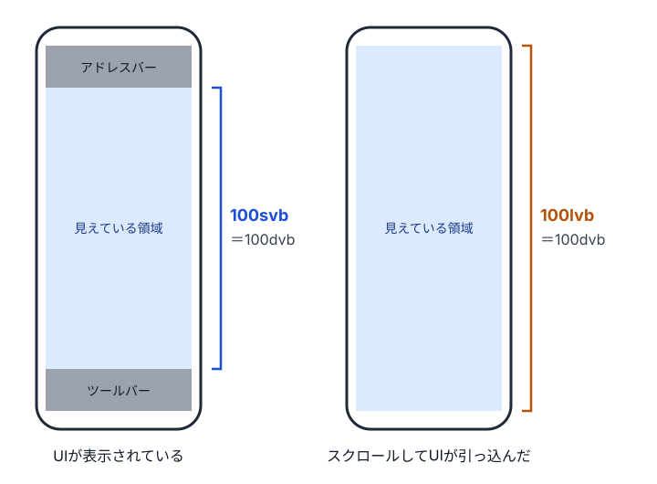

import Baseline from '../../../components/Baseline.astro';
import Demo from '../../../components/Demo.astro';
import Guideline from '../../../components/Guideline.astro';
import unitsHtml from '../../../demos/values/svi-and-cqi/index.html?raw';
import unitsCss from '../../../demos/values/svi-and-cqi/style.css?raw';

`vw` と `vh` は使いません。ビューポート単位が必要なときは、横方向は `svi`、縦方向は `svb` を優先し、スクロールで値が変わる `dvb` は避けます。`lvb` を使うのは、ブラウザのUIが出ていても引っ込んでいても高さいっぱいに広げたい、固定の背景などだけです。

ビューポート単位を使うのは、ページ全体の余白やヒーローのように、メディアクエリと対になる値です。置き場所が変わるコンポーネントの中で幅に応じて値を変えたいなら、名前付きのコンテナと `cqi` を使います。どちらの単位も、`%` やイントリンシックなレイアウトで解決できないときに使う手段です。

## vhとvwで起きる問題

画面の高さいっぱいのヒーローを作るとき、高さを `100vh` にする例をよく見かけます。PCのブラウザでは意図どおりに見えますが、スマートフォンでは下の部分がブラウザのツールバーに隠れることがあります。ヒーローの下端にボタンを置いていると、最初の表示でボタンが見えません。

```css title="🙅‍♂ Not Recommended: vw と vh で画面いっぱいに広げる"
/* 🙅‍♂ Not Recommended */
.hero {
  inline-size: 100vw;
  block-size: 100vh;
}
```

原因は、`vh` の基準が、最初に見えている領域ではないことです。モバイルのブラウザでは、アドレスバーやツールバーがスクロールに合わせて出入りし、そのたびに見えている領域の高さが変わります。現在のCSS Values Level 4では、接頭辞のない `vh` は、UIが引っ込んだ最も大きい領域（後述のラージビューポート）を基準にすると定められています。UIが表示されている最初の状態では、その分だけ要素が画面からはみ出すわけです。

この定義は、実装に合わせて後から決まりました。以前の仕様は、ブラウザのUIが出入りする場合を想定しておらず、どちらの高さを基準にするかは実質的にブラウザに任されていました。多くのブラウザが大きいほうを選んでいたため、仕様も、Webの互換性を保つため、その選択を引き継ぎました（2026年10月確認）。基準が定まったいまも、`vh` と書いただけでは、UIが出ている状態と引っ込んだ状態のどちらに合わせたいのかがコードから読み取れません。

`inline-size: 100vw` にも問題があります。`vw` はスクロールバーの幅を含めて計算されるので、スクロールバーが幅を取る環境では、要素がその分だけはみ出して横スクロールが起きます。Chrome 145からは、ルートに `scrollbar-gutter: stable` や `overflow: scroll` が指定されていると、`vw` がスクロールバーを除いて計算されるようになりました。どちらもスクロールバーの領域が常に確保される指定で、CSS Values Level 4の仕様に沿った動作です。本書で使う[kiso.css](/reset/kiso/)は前者の指定を含んでいます。SafariとFirefoxでは、`scrollbar-gutter: stable` を指定しても従来どおり横スクロールが起こりえます（2026年9月確認）。

## 3つのビューポートを使い分ける

こうした問題を解決するために、ビューポートの大きさを3つに分けた単位が追加されました。ブラウザのUIが表示されているときの最も小さい領域が「スモールビューポート」、UIが引っ込んだときの最も大きい領域が「ラージビューポート」です。そのときどきで実際に見えている領域を「ダイナミックビューポート」と呼びます。それぞれを参照する単位は、`sv*`、`lv*`、`dv*` で始まります。

{/* textlint-disable ja-technical-writing/sentence-length -- 画像の代替テキストは1文として数えられるため */}


{/* textlint-enable ja-technical-writing/sentence-length */}

<Baseline id="viewport-unit-variants" name="スモール・ラージ・ダイナミックのビューポート単位" />

単位の末尾には、`svw` や `svh` のような物理方向の書き方と、`svi` や `svb` のような論理方向の書き方があります。本書では論理プロパティにそろえて、インライン方向を表す `i` と、ブロック方向を表す `b` を使います。横書きなら、`i` が横方向、`b` が縦方向です。論理プロパティについては「[9-8 論理プロパティと論理値](/notation/logical-properties/)」で説明しています。

基本は、横方向が `svi`、縦方向が `svb` です。スモールビューポートを基準にしておけば、ブラウザのUIが表示されている最も狭い状態でも、要素が画面に収まります。また、後で説明する `cqi` は、有効なコンテナが見つからないときに `svi` として計算されます。横方向の基準を `svi` にそろえておけば、この振る舞いとも食い違いません。

`dvb` は、一見すると理想的な単位に見えます。しかし、ダイナミックビューポートの高さはUIが出入りするたびに変わるので、`dvb` で大きさを決めた要素は、スクロール中に伸び縮みします。後ろにある内容も押し下げられたり引き上げられたりして、レイアウトシフトが起きます。本書では、要素の大きさに `dvb` を使いません。

`lvb` を使うのは、ブラウザのUIの有無にかかわらず、常に画面の高さいっぱいに広げたい場合です。たとえば、`position: fixed` で固定した背景の高さが `100svb` だと、UIが引っ込んだときは下の端に隙間ができます。ラージビューポートを基準にすれば、スクロール中も背景が途切れません。

```css title="🙆‍♂ Recommended: ヒーローは svb、固定した背景は lvb"
@scope (.scoped.hero) to (.scoped) {
  :scope {
    display: block grid;
    align-content: end;
    min-block-size: 100svb;
  }
}

@scope (.scoped.page-background) to (.scoped) {
  :scope {
    position: fixed;
    inset-inline: 0;
    inset-block-start: 0;
    block-size: 100lvb;
    background-image: linear-gradient(oklch(95% 0.02 250deg), oklch(85% 0.05 250deg));
  }
}
```

ヒーローの高さは、`block-size` ではなく `min-block-size` で指定しています。「少なくとも画面の高さいっぱい」という指定にしておけば、内容が増えたときや文字サイズが大きくなったときにも、中身があふれずに要素が伸びます。

## ビューポート単位を使う値

ビューポート単位は、ページ全体の状態と結びついた値です。そのため、ページ全体の余白、ヒーロー、全幅の背景のように、ビューポートに対して成り立たせたい値に使います。メディアクエリと対になる単位です。メディアクエリを使う場面は「[13-4 メディアクエリ](/responsive/media-queries/)」で説明しています。

```css title="🙆‍♂ Recommended: ページのセクションの余白を、画面の幅に合わせて変える"
._page-section {
  /* 画面の幅 375px で 40px、1280px で 80px */
  padding-block: clamp(40px, 4.42svi + 23.43px, 80px);
}
```

ページのセクションの上下の余白は、どのセクションも同じ画面の上にあり、置き場所によって意味が変わりません。こうした値なら、ビューポートの幅に合わせて変えても問題はありません。余白は文字サイズの設定に追従させない値なので、この例では最小値と最大値をpxにしています。

反対に、置き場所が変わるコンポーネントの中では、ビューポート単位を使いません。同じカードをメインエリアとサイドバーに置くと、ビューポートの幅は同じでも、カードが使える幅は大きく違います。ビューポート単位で決めた値は、この違いを反映できません。

コンポーネントの中で幅に応じて値を変えたいときは、コンテナの幅を基準にした `cqi` を使います。`cqi` はコンテナのインライン方向のサイズの1%で、コンテナクエリと対になる単位です。ただし、有効なコンテナがないと `svi` として計算されるので、使えるのは、その要素が名前付きのコンテナの中にあると確実に言える場合に限ります。この条件と、`cqb` などを使わない理由は「[13-3 コンテナサイズクエリ](/responsive/container-size-queries/)」で説明しています。

## コード例とデモ

次のデモでは、同じカードをメインエリアとサイドバーに置いています。どちらのカードにも、`svi` で文字サイズが変わる行と、`cqi` で変わる行があります。幅のボタンで768px以上を選ぶと2カラムになり、違いが分かります。

<Demo title="svi と cqi で文字サイズを変えたときの、置き場所による違い" html={unitsHtml} css={unitsCss} variant="neutral" />

`svi` の行は、メインエリアとサイドバーで同じ大きさです。サイドバーは幅が狭いのに文字が大きいままなので、途中で折り返しています。`cqi` の行は、カードが置かれた場所の幅に合わせて大きさが変わり、サイドバーでは小さく収まります。どちらの行も最小値と最大値をremにした `clamp()` で書いていて、その組み立て方は「[6-3 計算関数で根拠を式に残す](/values/math-functions/)」で説明します。

## ビューポート単位だけの文字サイズ

文字サイズを `font-size: 5vw` や `4svi` のようにビューポート単位だけで決めると、画面の幅に比例して文字が大きくなります。手軽ですが、この書き方には大きな問題があります。ブラウザの文字サイズの設定を大きくしても、文字が大きくならないことです。

```css title="🙅‍♂ Not Recommended: ビューポート単位だけで文字サイズを決める"
/* 🙅‍♂ Not Recommended */
.hero-title {
  font-size: 5vw;
}
```

文字サイズの設定が変えるのはルートの文字サイズで、ビューポート単位はそれと関係がありません。さらに、ビューポート単位を直接使った値は、Chrome系のブラウザではズームしても拡大されないことがあります。文字を大きくしたいユーザーが、どちらの方法を試しても文字を大きくできなくなるわけです。

画面の幅に合わせて文字サイズを変えたいときは、`clamp()` を使います。最小値と最大値をremにして、推奨値をremとビューポート単位の和にすれば、remの部分が文字サイズの設定とズームに追従します。組み立て方は「[6-3 計算関数で根拠を式に残す](/values/math-functions/)」で、見出しや本文での使い分けは「[14-4 文字サイズと改行](/typography/size-and-line-breaks/)」で説明します。

## ビューポート単位を避けられる場面

ビューポート単位は、ほかの方法では解決できないときにだけ使います。先ほど触れたとおり、Chrome系のブラウザではビューポート単位を直接使った値がズームで拡大されないことがあり、スクロールバーの幅の扱いもブラウザによって異なるからです。`%` やイントリンシックなレイアウトで解決できるなら、そちらを優先します。

たとえば、`inline-size: 100vw` で要素を画面の幅いっぱいに広げる指定は、多くの場合なくても済みます。ブロック要素は、何も指定しなくても親の幅いっぱいに広がるからです。中央寄せのコンテンツから背景だけを画面の端まで広げたい場合も、グリッドの左右に余白の列を作る方法などで書けます。この方法は「[11-2 余白を設計する](/layout-practice/spacing/)」で扱います。

プロジェクト全体でビューポート単位を使う流体的な値を多用するなら、その都度値を書かずに、トークンかユーティリティにまとめます。基準にする画面の幅や係数がコードのあちこちに散らばると、カンプの幅が変わったときに直しきれなくなるからです。流体的な文字サイズをユーティリティにまとめる考え方は、「[6-3 計算関数で根拠を式に残す](/values/math-functions/)」で紹介します。

なお、kiso.cssは `body` の `min-block-size` に `100dvb` を指定しています。これはフッターを画面の下端に置くための最小の高さで、内容が画面より短く、スクロールが起きないときにだけ有効になる指定です。スクロールによる伸び縮みが問題にならない場面なので、`dvb` を使っています。

本書のStylelintの設定では、`unit-disallowed-list` で `vw`、`vh`、`vi`、`vb`、`vmin`、`vmax` を警告しています。`svh` や `svw` のような物理方向の単位は `logical-css/require-logical-units` が警告し、論理方向の `svb` や `svi` を勧めます。Stylelintの設定の全体は、「[19-1 Stylelintでルールを守る](/operations/stylelint/)」で説明します。

## ガイドライン

<Guideline />

## 参考リンク

- [CSS Values and Units Module Level 4: Viewport-percentage Lengths](https://www.w3.org/TR/css-values-4/#viewport-relative-lengths)
- [長さの単位（length） - CSS | MDN](https://developer.mozilla.org/ja/docs/Web/CSS/length)
- [CSS コンテナクエリ - CSS | MDN](https://developer.mozilla.org/ja/docs/Web/CSS/CSS_containment/Container_queries)
- [俺流レスポンシブコーディング 2025](https://speakerdeck.com/tak_dcxi/an-liu-resuponsibukodeingu-2025)（TAK、2025年11月）
